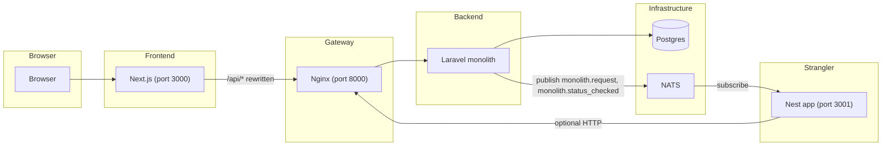

# Nest Lab

A full-stack blog application demonstrating a **strangler-fig** style architecture: a Laravel monolith as the core API, a Next.js frontend, and a NestJS app that subscribes to events over NATS (“the nervous system”). The Nest app can observe and eventually take over responsibilities from the monolith.

## Functionality

- **Blog**: Posts (paginated list, create, read, update, delete) and comments (list, create, update, delete). Post and comment ownership and policies are enforced in the monolith.
- **Auth**: JWT-based registration, login, logout, and current user via the Laravel API. Frontend stores the token and sends it on protected requests.
- **NATS event logging**: Every Laravel API request is published to NATS after the response; the Nest app subscribes and logs these events (and the existing `monolith.status_checked` from the status endpoint). The Nest app also publishes its own HTTP request logs to NATS.

## Architecture



- **Frontend (Next.js)**: Serves the blog UI (MUI + Tailwind). All API calls go to `/api/*`, which Next rewrites to Nginx.
- **Nginx**: Reverse proxy and entry point for the monolith. Routes requests to the Laravel app (PHP-FPM).
- **Laravel monolith**: REST API for auth, posts, and comments. Uses Postgres and JWT (e.g. tymon/jwt-auth). After each API request, middleware publishes a `monolith.request` event to NATS; the status route publishes `monolith.status_checked`.
- **Nest app**: HTTP server (e.g. root route) plus NATS microservice. Subscribes to `monolith.status_checked` and `monolith.request` and logs them. Also publishes its own request/error events to NATS. Intended as the future strangler for selected capabilities.
- **NATS**: Message broker. Laravel publishes events; Nest (and optionally other services) subscribe. No direct NATS connection from the frontend.
- **Postgres**: Database for users, posts, and comments.

## Setup

### Prerequisites

- **Docker** is required to run the full stack. Install Docker (and **Docker Desktop** on macOS or Windows) so that `docker` and `docker compose` are available:
  - **macOS / Windows**: Install [Docker Desktop](https://www.docker.com/products/docker-desktop/); it includes Docker Engine and Docker Compose.
  - **Linux**: Install [Docker Engine](https://docs.docker.com/engine/install/) and [Docker Compose](https://docs.docker.com/compose/install/) for your distribution.

No need to install PHP, Node, or Postgres on the host; they run inside containers.

### Steps

1. **Clone the repository** (if you have not already):

   ```bash
   git clone <repository-url>
   cd nest_lab
   ```

2. **Start the stack** (see [Running the project](#running-the-project)):

   ```bash
   docker compose up --build
   ```

3. **Apply migrations and seed the database** (first time or after pulling changes that touch the DB):

   ```bash
   docker compose exec laravel_monolith php artisan migrate --force
   docker compose exec laravel_monolith php artisan db:seed
   ```

After that, open the blog at http://localhost:3000.

## Repository layout

| Path | Role |
|------|------|
| `frontend/` | Next.js app (blog UI, auth, API client) |
| `laravel_monolith/` | Laravel API (auth, posts, comments, NATS publishing) |
| `nest_app/` | NestJS app (NATS subscribers, HTTP, NATS logging) |
| `nginx.conf` | Nginx config (proxy to Laravel) |
| `docker-compose.yml` | Services: postgres, nginx, nats, nats_tools, laravel_monolith, frontend, nest_app |

## Running the project

If this is your first time, follow [Setup](#setup) first.

1. **Start all services** (from repo root):

   ```bash
   docker compose up --build
   ```

2. **Access**:
   - **Blog UI**: http://localhost:3000 (Next.js)
   - **API via Nginx**: http://localhost:8000 (e.g. http://localhost:8000/api/status)
   - **Nest app**: http://localhost:3001
   - **NATS**: localhost:4222 (client); 8222 (monitoring)

3. **Optional**: Seed the Laravel DB (inside the Laravel container):

   ```bash
   docker compose exec laravel_monolith php artisan migrate --force
   docker compose exec laravel_monolith php artisan db:seed
   ```

4. **Watch NATS events** (e.g. from `nats_tools`):

   ```bash
   docker compose exec nats_tools nats sub -s nats:4222 "monolith.>"
   docker compose exec nats_tools nats sub -s nats:4222 "nest_app.>"
   ```

## Testing

- **Laravel**: `cd laravel_monolith && php artisan test` (unit and feature tests, including NATS logging with a fake).
- **Nest**: `cd nest_app && npm test` (unit tests, including NATS event handlers).
- **Frontend E2E**: Start frontend and API, then `cd frontend && npm run test:e2e` (Cypress). See `frontend/cypress/README.md`.

## Tech stack

- **Frontend**: Next.js 16, React 19, MUI, Tailwind CSS, TypeScript.
- **API**: Laravel (PHP), Postgres, JWT auth, Basis NATS client.
- **Strangler**: NestJS, NATS transport, Node.
- **Infra**: Docker Compose, Nginx, NATS, Postgres.
